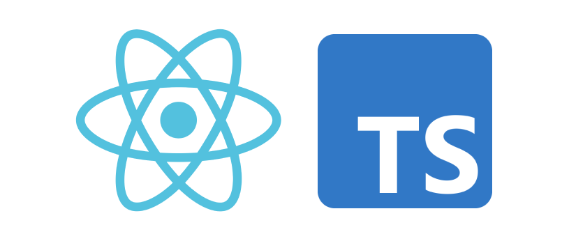
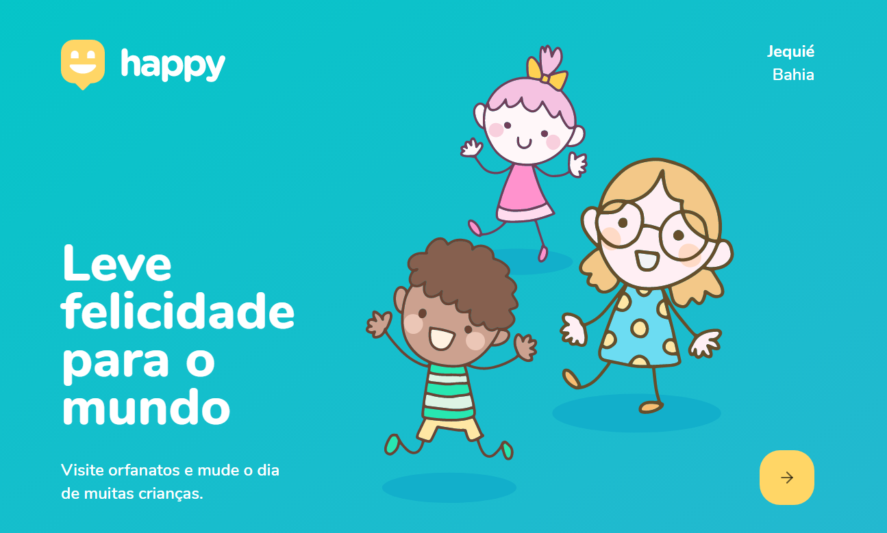

<br>
<div align="center">
  
</div>

<p align="center">
  
</p>


## 🚀 Getting started

To clone and run the application, you will need to have [Git](https://git-scm.com), [Node.js](https://nodejs.org) + [Yarn](https://yarnpkg.com) installed on your machine. With all programs installed, run the following command lines:


```bash
# Clone this repository
$ git clone https://github.com/pablo2p/Happy

# Access the repository
$ cd youtube-nextjs-design-system

# Install the dependencies
$ yarn install

# Run application
$ yarn dev
```


